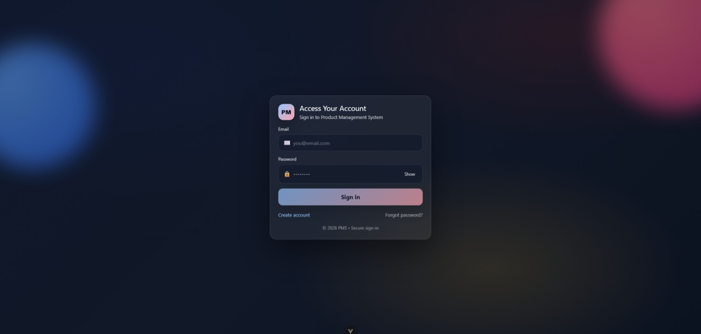
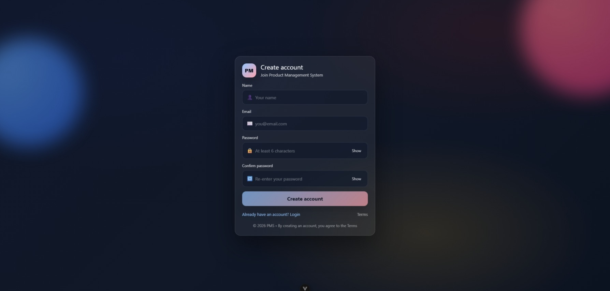

# 🧩 Product Management System

A full-stack Product Management System built with **Vue 3**, **Node.js**, **Express**, and **MongoDB**.  
Designed with a modern SaaS-style UI and scalable architecture.

---

## 🚀 Features

### 🔐 Authentication

- User Registration
- Secure Login (JWT-based authentication)
- Protected Routes
- Persistent session

### 📊 Dashboard

- Overview page after login
- Clean SaaS-style layout
- Collapsible Sidebar

### 📦 Product Management

- Product List
- Product Details
- Scalable structure for CRUD operations

### 🎨 UI/UX

- Modern Sidebar with collapse/expand
- Lucide Icons
- Responsive Layout
- Smooth transitions

---

## 🖼️ Screenshots

### 🔐 Login Page



### 📝 Register Page



---

## 🏗️ Tech Stack

### Frontend

- Vue 3 (Composition API)
- Vue Router
- Pinia
- Axios
- Lucide Icons

### Backend

- Node.js
- Express.js
- MongoDB
- Mongoose
- JWT Authentication
- bcrypt

---

## 📂 Project Structure

```
client/
  src/
    layouts/
    views/
    router/
    stores/

server/
  src/
    models/
    routes/
    middleware/
```

---

## ⚙️ Installation

### 1️⃣ Clone Repository

```bash
git clone https://github.com/your-username/product-management-system.git
cd product-management-system
```

---

### 2️⃣ Backend Setup

```bash
cd server
npm install
```

Create `.env` file:

```
PORT=4000
MONGO_URI=mongodb://127.0.0.1:27017/product_management
JWT_ACCESS_SECRET=your_secret_key
JWT_ACCESS_EXPIRES=15m
```

Run server:

```bash
npm run dev
```

---

### 3️⃣ Frontend Setup

```bash
cd client
npm install
npm run dev
```

Frontend runs on:

```
http://localhost:5173
```

---

## 🔐 Authentication Flow

1. User registers
2. Server hashes password with bcrypt
3. JWT access token is generated
4. Token stored in localStorage
5. Route guard protects private pages

---

## 📈 Future Improvements

- Product CRUD with real API integration
- Role-based access control (Admin/User)
- Refresh token implementation
- Pagination & Search
- Deployment (Docker + CI/CD)
- Unit Testing

---

## 📜 License

This project is for educational and portfolio purposes.

---

## 👨‍💻 Author

AmPerth
GitHub: https://github.com/thanakit-ty
